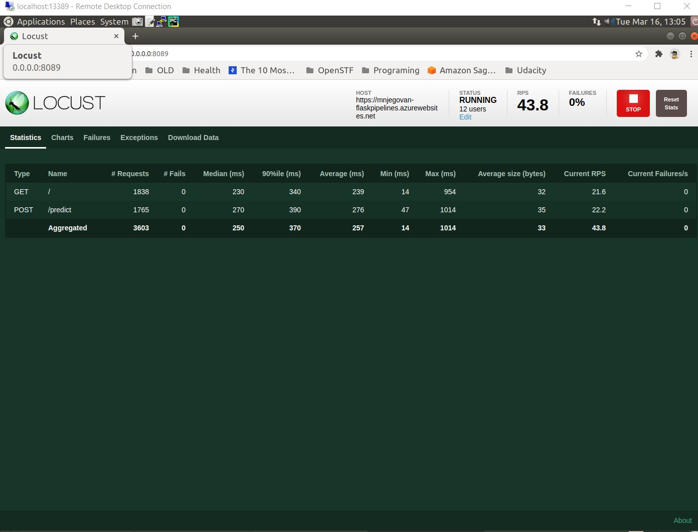

# Overview


[](https://github.com/mnjegovan-lab/udacity_devops_project_two_CI/actions/workflows/pythonapp.yml)

This is the second project of Udacity DevOps Engineer for Microsoft Azure Nanodegree Program.

This project builds CD pipeline using Azure Pipelines for a Python-based machine learning application.

## Project Plan
<TODO: Project Plan

* Trello board : [link](https://trello.com/b/W5nc5xae/udacitydevopsprojecttwocd)
* Project planning spreadsheet [link](https://docs.google.com/spreadsheets/d/1-9ILRP8bbXocpc4-n2Scd43UVbf96Oe-aBnB_BYbDDc/edit?usp=sharing)

## Instructions

* Architectural Diagram


* Project running on Azure App Service


* Project cloned into Azure Cloud Shell


* Passing tests that are displayed after running the `make all` command from the `Makefile`


* Output of a test run


* Successful deploy of the project in Azure Pipelines.  [Note the official documentation should be referred to and double checked as you setup CI/CD](https://docs.microsoft.com/en-us/azure/devops/pipelines/ecosystems/python-webapp?view=azure-devops).


* Running Azure App Service from Azure Pipelines automatic deployment


* Successful prediction from deployed flask app in Azure Cloud Shell.  [Use this file as a template for the deployed prediction](https://github.com/udacity/nd082-Azure-Cloud-DevOps-Starter-Code/blob/master/C2-AgileDevelopmentwithAzure/project/starter_files/flask-sklearn/make_predict_azure_app.sh).
The output should look similar to this:


```bash
udacity@Azure:~$ ./make_predict_azure_app.sh
Port: 443
{"prediction":[20.35373177134412]}
```

* Output of streamed log files from deployed application

> 

https://mnjegovan-flaskpipelines.scm.azurewebsites.net/api/logs/docker


```json
[{
"machineName":"pl0sdlwk00001I_default",
"lastUpdated":"2021-03-10T11:51:47.8195533Z",
"size":23382,
"href":"https://mnjegovan-flaskpipelines.scm.azurewebsites.net/api/vfs/LogFiles/2021_03_10_pl0sdlwk00001I_default_docker.log",
"path":"/home/LogFiles/2021_03_10_pl0sdlwk00001I_default_docker.log"
},
{
"machineName":"pl0sdlwk00001I",
"lastUpdated":"2021-03-10T11:51:06.9256643Z",
"size":1582,
"href":"https://mnjegovan-flaskpipelines.scm.azurewebsites.net/api/vfs/LogFiles/2021_03_10_pl0sdlwk00001I_docker.log",
"path":"/home/LogFiles/2021_03_10_pl0sdlwk00001I_docker.log"
}]
```

View the log file in Azure App Service - Log Stream :


Load Test with locust : 


## Enhancements

Introduce staging, creating multiple branches to be able to test and deploy code to stageing enviroment and only afterwards to production.

Extend testing scope to achive ussure better code quality.

Contenerize the app and move it to Kbernetes cluster

## Demo 

<TODO: Add link Screencast on YouTube>


